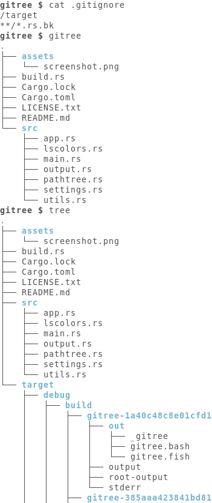

# Gitree

Gitree is a shell tool that prints a directory tree while respecting [gitignore rules](https://git-scm.com/docs/gitignore).

Gitree is just a small personal project to learn some Rust :slightly_smiling_face:.
If you are looking for a listing tool with a tree view and support for gitignore rules, you might be interested in [exa](https://git-scm.com/docs/gitignore).

## Screenshot



## Installation

You may install `gitree` locally by running

```console
$ cargo install --git https://github.com/vivienm/gitree.git
```
