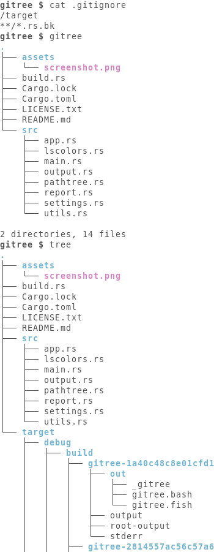

# Gitree

Gitree is a shell tool that prints a directory tree
while respecting [gitignore rules][gitignore].

Gitree is just a small personal project to learn some Rust :)
If you are looking for a listing tool
with a tree view and support for gitignore rules,
you might be interested in [exa][exa].

[exa]: https://the.exa.website
[gitignore]: https://git-scm.com/docs/gitignore

## Screenshot



## Installation

```bash
git clone https://github.com/vivienm/gitree
cd gitree

cargo build
cargo test
cargo install

export PATH="$HOME/.cargo/bin:$PATH"
gitree --help
```
